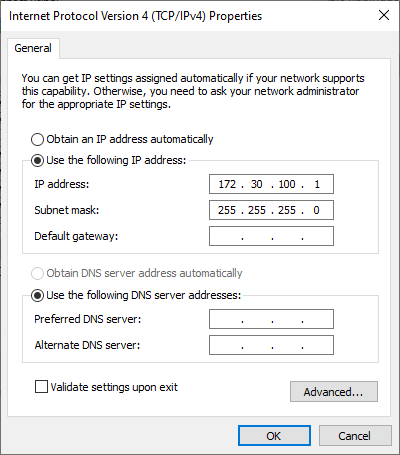
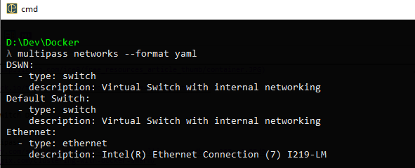
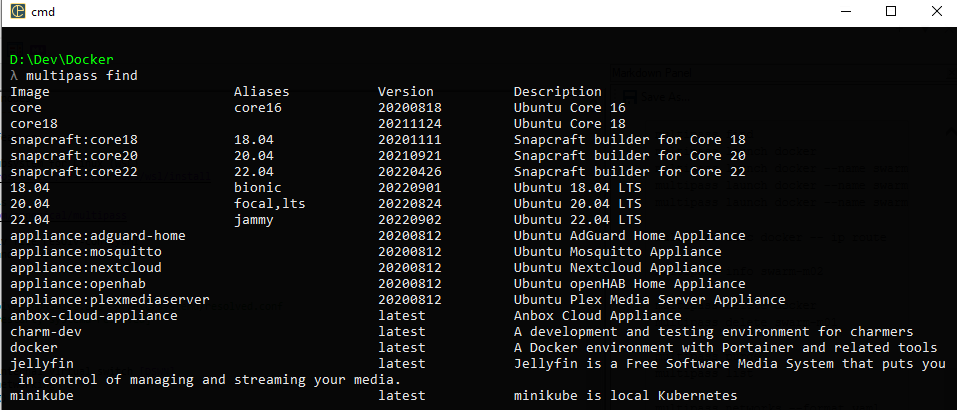
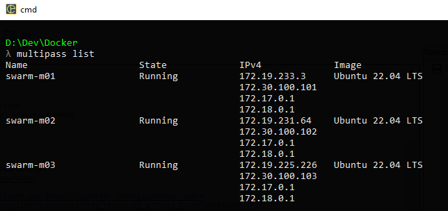
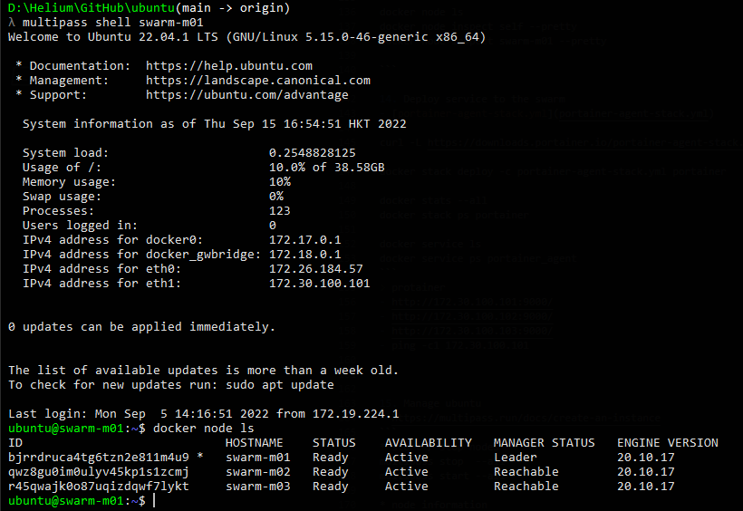

# notes for ubuntu swarm #

1. Enable Hyper-V feature

2. Enable Windows Subsystem for Linux (WSL)
   - <https://docs.microsoft.com/en-us/windows/wsl/install>

3. Install multipass
   - <https://ubuntu.com/tutorials/install-ubuntu-server#1-overview>
   - <https://github.com/canonical/multipass>
   - <https://multipass.run/docs/create-an-instance>
   - <https://multipass.run/docs/networks-command>
   - <https://programming.vip/docs/add-fixed-ip-to-ubuntu-instance-of-multipass.html>

4. Create DNS resolv file [resolv-conf.yaml](resolv-conf.yaml)
   - for linux apt-get command to work

    ```yml
    #cloud-config
    bootcmd:
        - printf "[Resolve]\nDNS=8.8.8.8" > /etc/systemd/resolved.conf
        - [systemctl, restart, systemd-resolved]
    ```

5. Create Hyper-V internal virtual switch [DSWN]
   - for swarm nodes networking  
     
   - set subnet  
     

6. Open window command prompt or powershell
   - check network

    ```
    multipass networks --format yaml

    multipass get local.bridged-network
    multipass set local.bridged-network=DSWN
    ```  

   

7. Check unbuntu version you want to use
   - install docker engine if you use clean ubuntu image
   - <https://docs.docker.com/engine/install/ubuntu/#install-using-the-convenience-script>

    ```
    multipass find
    ```  

   

8. Use ubuntu latest image with docker installed
   - create 3 ubuntu nodes

    ```
    multipass launch docker --name swarm-m01 --network name=DSWN,mode=manual --cloud-init __path_to__\resolv-conf.yaml
    multipass launch docker --name swarm-m02 --network name=DSWN,mode=manual --cloud-init __path_to__\resolv-conf.yaml
    multipass launch docker --name swarm-m03 --network name=DSWN,mode=manual --cloud-init __path_to__\resolv-conf.yaml

    * list ubuntu nodes
    multipass list
    ```

   

9. Update system packages (repeat for each nodes)

    ```
    * open linux shell terminal
    multipass shell swarm-m01
    multipass shell swarm-m02
    multipass shell swarm-m03

    * check DNS
    - ping -c1 8.8.8.8

    * linux root mode
    sudo -s

    apt-get install ca-certificates curl gnupg lsb-release -y
    apt-get install iproute2 net-tools -y
    apt-get install python3-pip -y 

    apt-get install docker-compose -y
    apt-get update && apt-get upgrade -y
    ```

10. Check docker versions

    ```
    docker --version
    docker-compose --version

    ```

11. Edit the network settings (repeat for each nodes)

    - <https://netplan.io/examples>
    - [sample file for node1](m01-cloud-init.yaml)
    - [sample file for node2](m02-cloud-init.yaml)
    - [sample file for node3](m03-cloud-init.yaml)

    ```yml
    * mount the local path to copy the yaml
    multipass set local.privileged-mounts=Yes

    multipass mount D:\Dev\Docker\dsw swarm-m01:/home/ubuntu/dsw
    multipass mount D:\Dev\Docker\dsw swarm-m02:/home/ubuntu/dsw
    multipass mount D:\Dev\Docker\dsw swarm-m03:/home/ubuntu/dsw

    cp /etc/netplan/50-cloud-init.yaml ./m01-cloud-init.yaml
    cp /etc/netplan/50-cloud-init.yaml ./m02-cloud-init.yaml
    cp /etc/netplan/50-cloud-init.yaml ./m03-cloud-init.yaml

    * linux editor
    nano /etc/netplan/50-cloud-init.yaml

    * add the config below
    * change the node IP addresse eg. 101 ... 102 ... 103

    eth1:
      addresses: [172.30.100.101/24]
      nameservers:
        addresses: [8.8.8.8]
      dhcp4: no
      routes:
        - to: 172.30.100.0/24
          via: 172.30.100.1
          on-link: true
          metric: 100
          table: 101

    * command to validate the settings
    netplan try
    netplan apply

    reboot 
    ```

12. Initialize swarm leader node (swarm-m01)
    - <https://docs.docker.com/engine/swarm/join-nodes/>

    ```
    docker swarm init --advertise-addr 172.30.100.101

    * get the token for other manager nodes
    docker swarm join-token manager
    ```

13. Join the other manager nodes

    ```
    docker swarm join --token SWMTKN-1-xxxxxxxxxxxxxxxxxxxxxxxxxxxxxxx 172.30.100.101:2377

    ```

14. Manage nodes
    - <https://docs.docker.com/engine/swarm/manage-nodes/>
    

    ```
    docker node ls
    docker node inspect self --pretty
    docker node inspect swarm-m01 --pretty

    ```

15. Deploy service to the swarm
    - [portainer-agent-stack.yml](portainer-agent-stack.yml)

    ```
    curl -L https://downloads.portainer.io/portainer-agent-stack.yml -o portainer-agent-stack.yml

    docker stack deploy -c portainer-agent-stack.yml portainer

    docker stats --all
    docker stack ps portainer

    docker service ls
    docker service ps portainer_agent
    ```

    > protainer

    - <http://172.30.100.101:9000/>
    - <http://172.30.100.102:9000/>
    - <http://172.30.100.103:9000/>
    - ping -c1 172.30.100.101

16. Manage ubuntu
    - <https://multipass.run/docs/create-an-instance>

    ```
    * start / stop nodes
    multipass stop  --all
    multipass start --all

    multipass start swarm-m02

    * node information
    multipass info swarm-m01
    ```
  
## References ##

> identify the container of a task in a docker swarm

- <https://www.yvesdennels.com/posts/identify_container_docker_swarm/>

> network adapater with fix IP

- <https://netplan.io/examples>

> swarm ingress routing

- <https://docker-tutorial.schoolofdevops.com/swarm-networking-deepdive/>
- <https://github.com/nicolaka/netshoot>


```
docker network ls
docker network inspect ingress
docker network inspect docker_gwbridge
```
