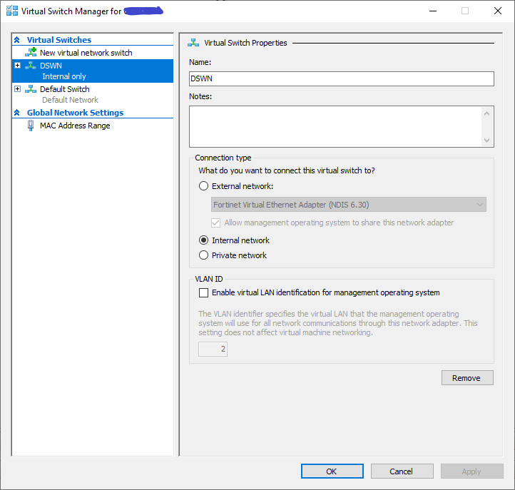

notes for ubuntu swarm
----------------------

1. Enable Hyper-V feature 

2. Enable Windows Subsystem for Linux (WSL)
- https://docs.microsoft.com/en-us/windows/wsl/install

3. Install multipass 
- https://github.com/canonical/multipass

4. Create DNS resolv file [resolv-conf.yaml](resolv-conf.yaml)
- for linux apt-get command to work 
```
#cloud-config
bootcmd:
    - printf "[Resolve]\nDNS=8.8.8.8" > /etc/systemd/resolved.conf
    - [systemctl, restart, systemd-resolved]

```

5. Create Hyper-V internal virtual switch [DSWN]
- for swarm nodes networking  

- set subnet  


6. Open window command prompt or powershell
- check network
```
multipass networks --format yaml
```  


- Check unbuntu version you want to use
  - install docker engine if you use clean ubuntu image
  - https://docs.docker.com/engine/install/ubuntu/#install-using-the-convenience-script
```
multipass find
```  


7. Use ubuntu latest image with docker installed
- create 3 ubuntu nodes 
```
multipass launch docker --name swarm-m01 --network name=DSWN,mode=manual --cloud-init __path_to__\resolv-conf.yaml
multipass launch docker --name swarm-m02 --network name=DSWN,mode=manual --cloud-init __path_to__\resolv-conf.yaml
multipass launch docker --name swarm-m03 --network name=DSWN,mode=manual --cloud-init __path_to__\resolv-conf.yaml

* list ubuntu nodes
multipass list
```


8. Update system packages (repeat for each nodes)
- 
```
* open linux shell terminal
multipass shell swarm-m01

* check DNS
- ping -c1 8.8.8.8

* linux root mode
sudo -s

apt-get install ca-certificates curl gnupg lsb-release -y
apt-get install iproute2 net-tools -y
apt-get install python3-pip -y 

apt-get install docker-compose -y
apt-get update && apt-get upgrade -y

```

9. Check docker versions
```
docker --version
docker-compose --version

```

10. Edit the network settings (repeat for each nodes)
- [sample file for node1](m01-cloud-init.yaml)
- [sample file for node2](m02-cloud-init.yaml)
- [sample file for node3](m03-cloud-init.yaml)
```
* linux editor
nano /etc/netplan/50-cloud-init.yaml

* add the config below
* change the node IP addresse eg. 101 ... 102 ... 103

eth1:
  addresses: [172.30.100.101/24]
  nameservers:
    addresses: [8.8.8.8]
  dhcp4: no
  routes:
    - to: 172.30.100.0/24
      via: 172.30.100.1
      on-link: true
      metric: 100
      table: 101

* command to validate the settings
netplan try

reboot 
```

11. Initialize swarm leader node (swarm-m01)
- https://docs.docker.com/engine/swarm/join-nodes/

```
docker swarm init --advertise-addr 172.30.100.101

* get the token for other manager nodes
docker swarm join-token manager
```

12. Join the other manager nodes
```
docker swarm join --token SWMTKN-1-xxxxxxxxxxxxxxxxxxxxxxxxxxxxxxx 172.30.100.101:2377

```

13. Manage nodes
- https://docs.docker.com/engine/swarm/manage-nodes/


```
docker node ls
docker node inspect self --pretty
docker node inspect swarm-m01 --pretty

```

14. Deploy service to the swarm
- [portainer-agent-stack.yml](portainer-agent-stack.yml)
```
curl -L https://downloads.portainer.io/portainer-agent-stack.yml -o portainer-agent-stack.yml

docker stack deploy -c portainer-agent-stack.yml portainer

docker stats --all
docker stack ps portainer

docker service ls
docker service ps portainer_agent
```
> protainer 
- http://172.30.100.101:9000/
- http://172.30.100.102:9000/
- http://172.30.100.103:9000/
- ping -c1 172.30.100.101


15. Manage ubuntu
- https://multipass.run/docs/create-an-instance
```
* start / stop nodes
multipass stop  --all
multipass start --all

* node information
multipass info swarm-m01


```
  
  
References
----------
> network adapater with fix IP
- https://netplan.io/examples


> swarm ingress routing
- https://upcloud.com/resources/tutorials/load-balancing-docker-swarm-mode
- https://docker-tutorial.schoolofdevops.com/swarm-networking-deepdive/
- https://github.com/nicolaka/netshoot


```
docker network inspect ingress

docker network inspect docker_gwbridge
```

